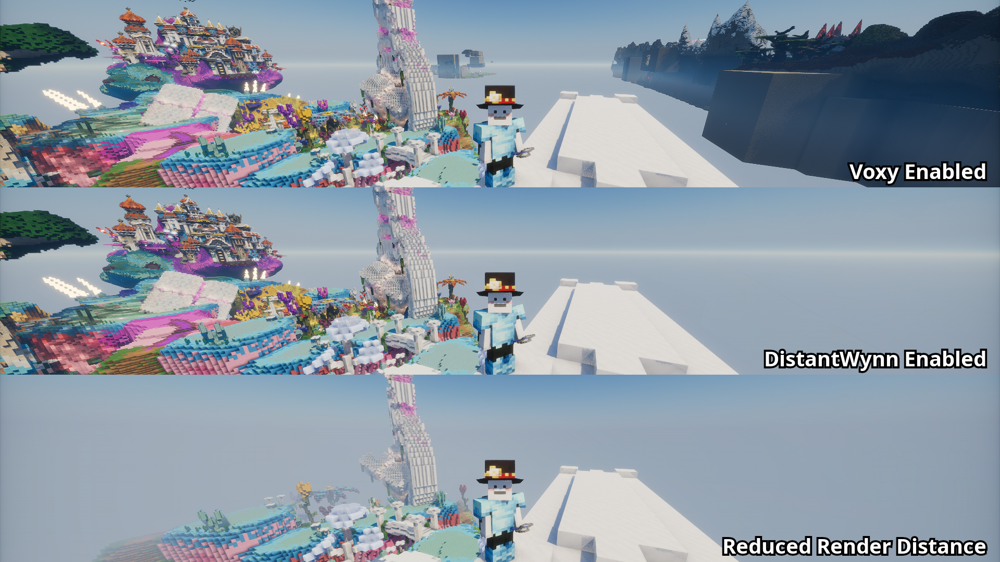

# DistantWynn

Dynamically adjust the visible region based on the player's location in Wynncraft.

## Features

- List of predefined regions:
  - Wynn (main region)
  - Realm of Light
- Voxy support:
  - Automatic region detection outside the predefined list

## Roadmap

- [ ] Distant Horizons support
- [x] Options to disable features
- [ ] Load the *set* of region boundaries from a file
- [x] Make a unique logo

## License

This project is available under the CC0 license.
